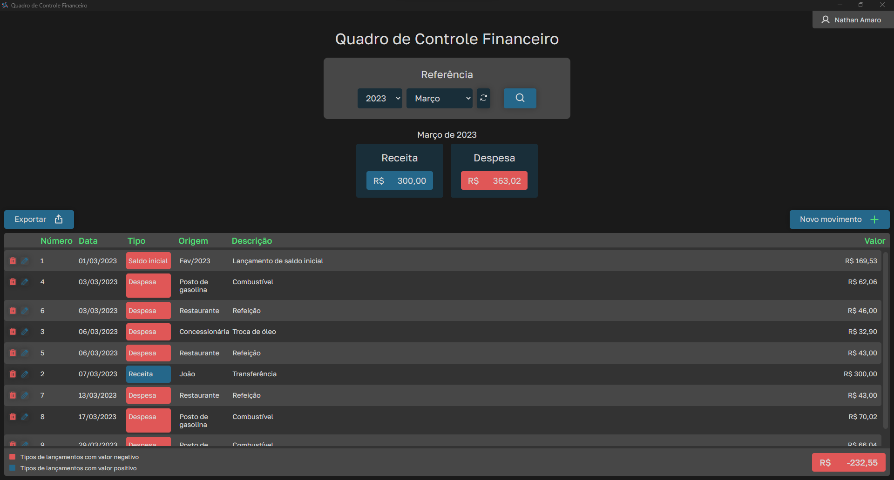
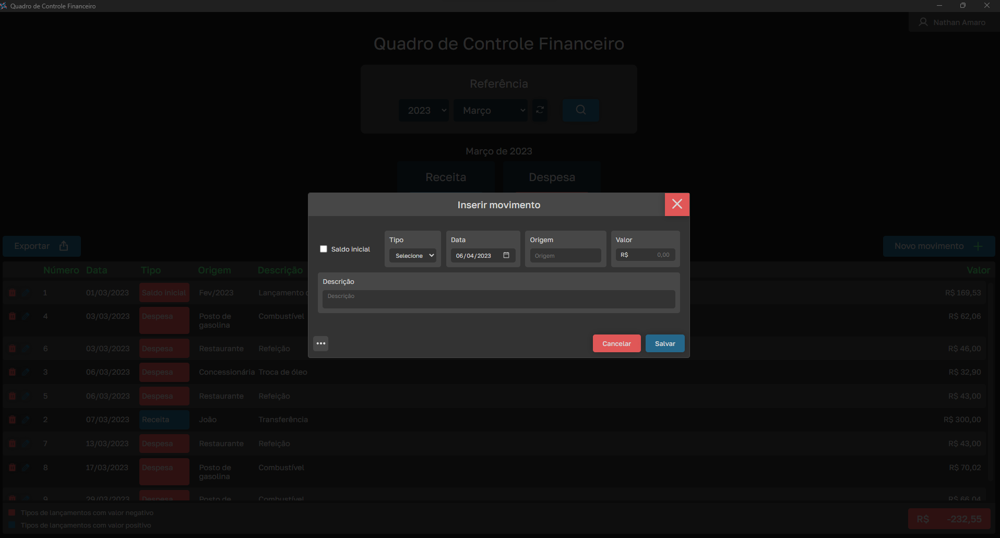

<h1 align="center">Quadro de Controle Financeiro</h1>

Aplicação simples para controle financeiro

### :bulb: Motivação

Este projeto foi pensado para resolver um problema pontual. Uma planilha em Excel mensal era necessária para que eu demonstrasse todas minhas despesas e receitas dentro do mês, mas, não existia um padrão para os dados. Depois que o padrão dos dados foi estabelecido surgiu um outro problema, a licença do Microsoft Office estava para expirar e nem todos do meu ambiente profissional possuíam um editor de planilhas. Juntando a necessidade de possuir algo que padronizasse os lançamentos com a minha vontade de desenvolver uma aplicação instalável e leve, surgiu então a ideia de desenvolver um aplicativo em ElectronJS para praticar e me familiarizar com esta ferramenta.

### :white_check_mark: Características

- [x] Cadastro de movimentações do tipo **Despesa** ou **Receita**
- [x] Fácil visualização em tabela das movimentações por **referência selecionada**
- [x] Exportação dos movimentos para PDF
- [x] Exportação dos movimentos para XLSX

### :camera: Capturas de tela

* Tela inicial

<h1 align="center">
  
</h1>

* Cadastro de movimento

<h1 align="center">
  
</h1>

* Exportações

<h1 align="center">
  
</h1>

### :wrench: Tecnologias

A seguir, algumas das ferramentas que foram usadas na construção do projeto:

- [Node.js](https://nodejs.org/en/) v18.12.0
- [Electron.js](https://www.electronjs.org/)
- [Sequelize](https://sequelize.org/)
- [SQLite3](https://www.npmjs.com/package/sqlite3/)